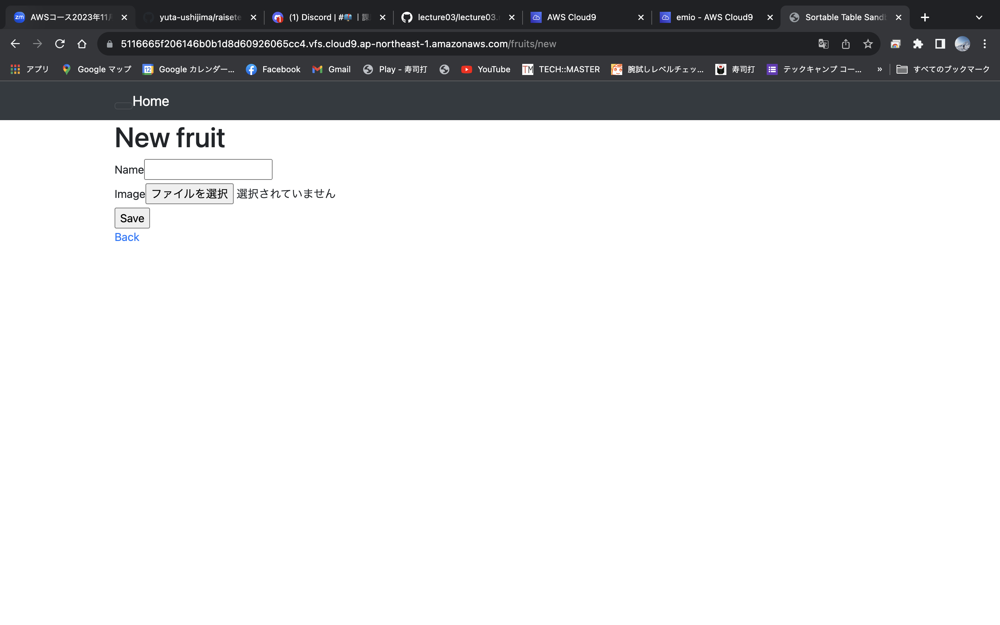
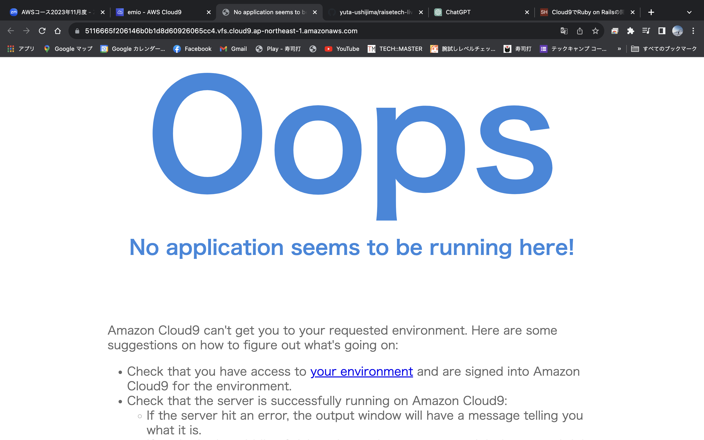
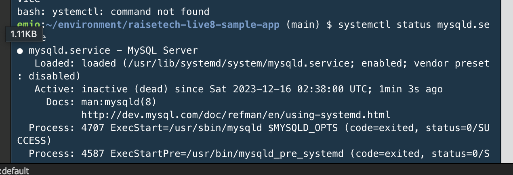
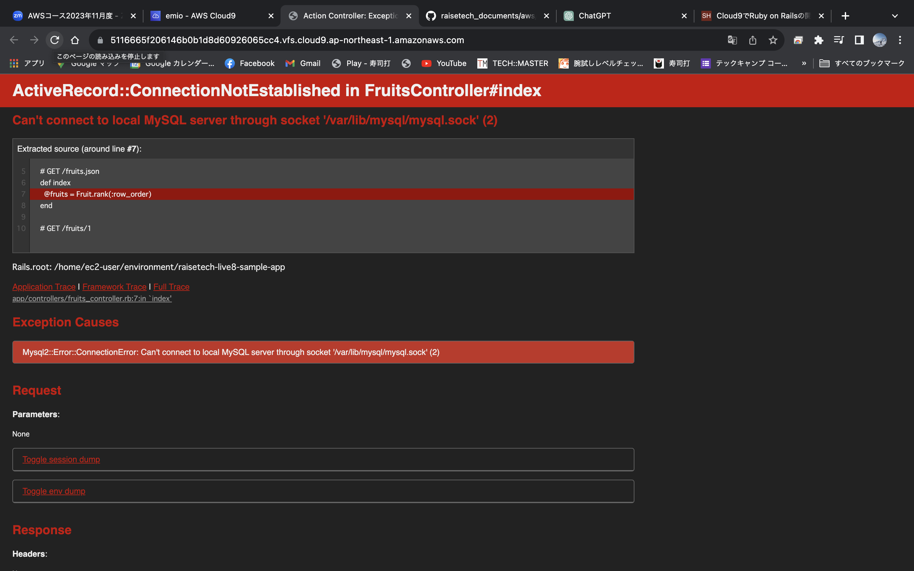

# 第3回課題提出
## Ruby on rails 起動

## APサーバー
* 名前とversionの確認：Puma vesion 7.0.4
* control + Cで停止させた際

## DBサーバー
* 名前とversionの確認：MySQL version 8.0.3
* $ sudo systemctl stop mysqld.service で停止
* $ sudo systemctl status mysqld.service でstatusの確認
* $ sudo systemctl start mysqld.service　で再開

## Ruby on rails 構成管理ツール
* 名前：Bundler
　
BundlerはRubyにおけるプロジェクトのライブラリ→これをGemの管理ツール。

## 今回学んだこと
### APサーバー
* クライアントがアプリケーションに送るリクエストに対して適切に処理する役割を担っている。

### DBサーバー
* アプリケーションとデータベース間のやり取りを担当している
* 情報の格納や取得

### 全体
* どちらのサーバーもないとアプリケーションが動かないということがわかった
* データベースは情報を格納取得、そういったやり取りが必要しないWebサイト（静的）なものにはDBサーバーがそもそもいらないのか？それとも。。。
→阿部寛のサイトを見てみた。データベースはつまり情報のやり取りということを考えると何かを入力したり入力したことがサイト上に何か変化を与えたり、という状況のことを考えると確かにそう言ったことはない。つまり阿部寛のサイトはDBサーバーがいらないのか？
* rails起動するにあたり講習の動画を何度も止めてどんなコマンドを打っていてそのコマンドにどんな意味があるのかをふかぼっていった。

### やっていたことのざっくりとした流れ
* DBサーバーの取得と起動
* 指定された環境構築
* APサーバーの起動

### 思ったこと
* やっていたことはとてもシンプルなのだが0からじゃあ立ち上げてくださいと言われると全く行き詰まっていたと思う、これは何度もやることで経験として培われていくのか、どの程度今理解しておくのがいいのか悩む。

